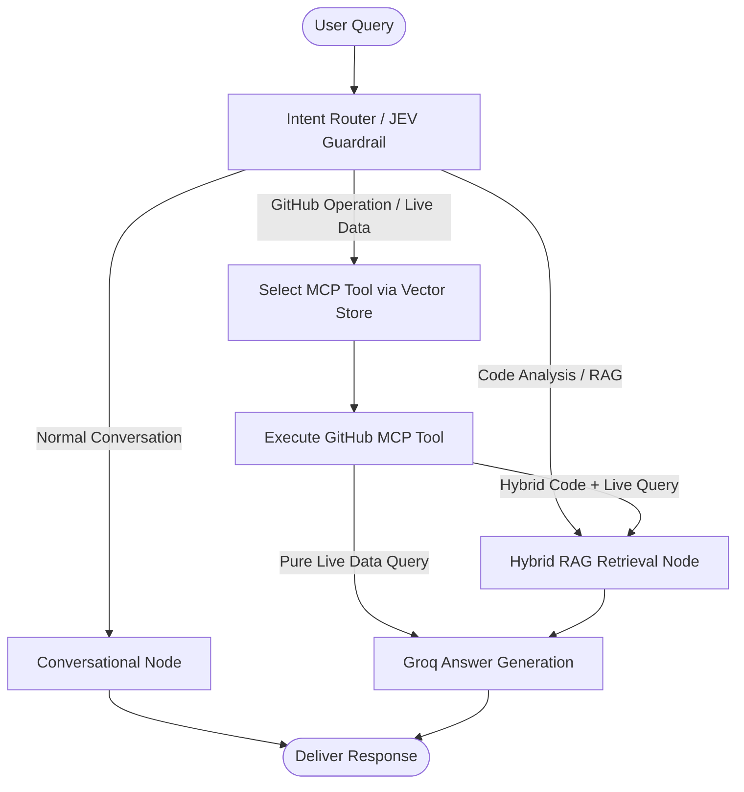
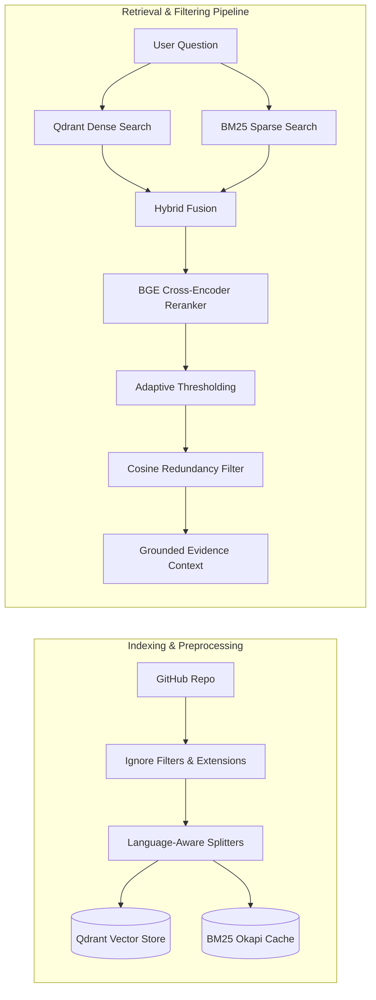

# 🐙 GitHub Repository Intelligence Agent

[](https://fastapi.tiangolo.com/)
[](https://langchain-ai.github.io/langgraph/)
[](https://qdrant.tech/)
[](https://groq.com/)
[](https://modelcontextprotocol.io/)
[](https://www.python.org/)

An enterprise-grade, agentic AI assistant engineered to deeply inspect, analyze, and interact with any GitHub repository. By unifying **Agentic RAG**, the **GitHub Model Context Protocol (MCP)**, **Qdrant Vector Database**, **LangGraph**, and **Groq LLMs**, this agent seamlessly answers architecture questions, performs deep codebase searches, and executes live GitHub repository operations.

---

## 🌟 Key Highlights

- **🎯 Intelligent Intent Routing & Guardrails**: Analyzes incoming user queries with OpenRouter JEV decision models to dynamically route between conversational chit-chat, repository code RAG, and live GitHub MCP tool execution.
- **⚡ GitHub Model Context Protocol (MCP)**: Runs the official GitHub MCP server in a Docker container to discover and invoke live GitHub tools (issues, pull requests, commits, branches, directory navigation) with automatic parameter generation from tool JSON Schemas.
- **🔍 Multi-Stage Hybrid RAG Engine**:
  - **Code-Aware Chunking**: Language-specialized chunking (Python, JavaScript, TypeScript, Go, Java, Rust, Markdown, etc.) preserving syntax and structural boundaries.
  - **Hybrid Search**: Combines dense vector semantic similarity (Qdrant) with sparse keyword lexical search (BM25 Okapi) with persistent disk caching.
  - **Cross-Encoder Reranking**: Re-scores top evidence chunks using `BAAI/bge-reranker-base` with sigmoid logit normalization.
  - **Adaptive Thresholding & Deduplication**: Discards irrelevant chunks and filters redundant snippets using cosine similarity (threshold `0.85`).
- **🛡️ Strict Grounding & Source Attribution**: Synthesizes verified answers with exact file paths, chunk references, and language metadata, eliminating hallucinations.
- **💻 Interactive Terminal Web UI & CLI**: Features a responsive terminal-inspired UI with Markdown rendering, syntax highlighting, live status badges, and source inspection.

---

## 🏗️ Architecture

### 1. LangGraph Agent State Machine



### 2. Multi-Stage Hybrid Retrieval Pipeline



---

## 🛠️ Tech Stack

| Component | Technology | Description |
|---|---|---|
| **Agent Orchestration** | LangGraph & LangChain | State machine graphs with conditional routing and state management |
| **LLM Inference** | Groq (`openai/gpt-oss-120b`) | Ultra-fast inference for argument synthesis and answer generation |
| **Vector Database** | Qdrant Cloud / Local | Stores semantic embeddings for code chunks and MCP tool definitions |
| **Dense Embeddings** | BAAI `bge-small-en-v1.5` / Google Gemini | High-density semantic vector representations |
| **Sparse Lexical Search** | `rank-bm25` (BM25Okapi) | Exact keyword matching with persistent disk caching |
| **Reranking** | BAAI `bge-reranker-base` | Cross-encoder relevance scoring with sigmoid scaling |
| **Guardrails & Routing**| OpenRouter JEV (`typesafe/jev-1.13`) | Evaluates query intent and semantic tool selection confidence |
| **Live Tool Protocol** | GitHub MCP (`ghcr.io/github/github-mcp-server`) | Dockerized Model Context Protocol server over stdio |
| **API Backend** | FastAPI & Uvicorn | High-concurrency async REST API |
| **Web Frontend** | Vanilla HTML5/CSS3 + JS | Dark terminal interface with Marked.js and Highlight.js |

---

## 📁 Repository Structure

```text
GIT RAG/
├── main.py                     # Application entry point (FastAPI + Uvicorn)
├── requirement.txt             # Project dependencies
├── context.md                  # Comprehensive technical specification
├── README.md                   # Project documentation
├── src/
│   ├── app.py                  # FastAPI application & REST endpoints (/chat, /health)
│   ├── agent.py                # LangGraph agent graph, state definitions & routing
│   ├── guardrial.py            # OpenRouter JEV intent classification guardrail
│   ├── intent_router.py        # Query classification router wrapper
│   ├── retriver.py             # Multi-stage retrieval orchestrator & context builder
│   ├── repo_search.py          # Code extraction, BM25 indexing, Qdrant store & reranker
│   ├── embedding_model.py      # HuggingFace BGE embedding setup
│   ├── llm.py                  # LLM provider configurations (Groq, Google GenAI)
│   ├── mcp_setup.py            # Docker stdio client for GitHub MCP server
│   ├── prompt_helper.py        # System prompt templates for grounded answering
│   ├── qdrant_setup.py         # Qdrant client connection & tool store builder
│   ├── repo_helper.py          # GitHub URL parser & identifier normalizer
│   ├── logger.py               # Centralized logging configuration
│   ├── static/
│   │   └── index.html          # Interactive dark terminal web interface
│   └── tools/
│       ├── jev.py              # JEV ranking model for MCP tool evaluation
│       └── tool_selector.py    # MCP tool discovery, deduplication, and selection
└── logs/
    └── bm25_cache/             # Serialized BM25 caches per repository
```

---

## 🚀 Getting Started

### 1. Prerequisites

- **Python 3.10+**
- **Docker Desktop** (must be running to start the GitHub MCP server)
- **Qdrant** (Free Qdrant Cloud cluster or local Docker container)
- **GitHub Personal Access Token (PAT)** with repository read permissions

### 2. Clone and Setup Environment

```bash
# Clone the repository
git clone https://github.com/<your-username>/git-rag.git
cd "GIT RAG"

# Create and activate virtual environment
python -m venv myvenv

# Windows (PowerShell)
.\myvenv\Scripts\Activate.ps1

# Linux / macOS
source myvenv/bin/activate

# Install dependencies
pip install -r requirement.txt
```

### 3. Pull the GitHub MCP Docker Image

Ensure Docker Desktop is running, then pull the official GitHub MCP server:

```bash
docker pull ghcr.io/github/github-mcp-server
```

### 4. Configure Environment Variables

Create a `.env` file in the root directory:

```env
# Groq API for lightning-fast LLM responses
GROQ_API_KEY=gsk_your_groq_api_key

# GitHub Personal Access Token for the MCP Server
GITHUB_PERSONAL_ACCESS_TOKEN=ghp_your_github_personal_access_token

# Qdrant Vector Database
QDRANT_URL=https://your-cluster-id.eu-central-1-0.aws.cloud.qdrant.io
QDRANT_API_KEY=your_qdrant_api_key

# OpenRouter for JEV Guardrails & Intent Routing
OPENROUTER_API_KEY=sk-or-v1-your_openrouter_api_key
OPENROUTER_MODEL=typesafe/jev-1.13-20260917

# Optional: Google Gemini API (if using Gemini models)
GOOGLE_API_KEY=your_google_api_key
```

---

## 🖥️ Running the Application

### Option A: Web Application (FastAPI + UI)

Launch the FastAPI server:

```bash
python main.py
```
*Or using Uvicorn directly:*
```bash
uvicorn src.app:app --host 127.0.0.1 --port 8000 --reload
```

- **Web Interface**: Open [http://127.0.0.1:8000](http://127.0.0.1:8000)
- **Interactive Swagger Docs**: Open [http://127.0.0.1:8000/docs](http://127.0.0.1:8000/docs)

### Option B: Interactive Terminal CLI

Run the agent directly in your console:

```bash
python -m src.agent
```

You will be prompted to enter the repository URL and your queries in an interactive loop.

---

## 🔌 API Reference

### `POST /chat`

Submits a question against a target repository.

**Request Body:**
```json
{
  "repository_url": "octocat/Hello-World",
  "question": "Explain the architecture of this repository and list open issues."
}
```

**Response Body:**
```json
{
  "repository": "octocat/Hello-World",
  "question": "Explain the architecture of this repository and list open issues.",
  "selected_tool": "list_issues",
  "sources": [
    "src/index.js",
    "README.md"
  ],
  "answer": "### Architecture Overview\nThe repository is structured around...\n\n### Open Issues\n1. Issue #42: Feature request for..."
}
```

### `GET /health`

Performs a lightweight liveness check.

**Response:**
```json
{
  "status": "ok"
}
```

---

## 💡 Example Queries

| Intent Category | Example Query | System Behavior |
|---|---|---|
| **Code Understanding** | `"How does JWT authentication work in this repo?"` | Retrieves code chunks via Hybrid Search, reranks with BGE, explains logic with file links. |
| **Architectural Overview**| `"Explain the RAG pipeline and state machine flow."` | Aggregates high-relevance code evidence and outlines system design. |
| **Live GitHub Issue** | `"Show me all open bug reports and recent pull requests."` | Selects `list_issues` MCP tool, fetches live GitHub data, formats output. |
| **Hybrid Analysis** | `"Are there any open issues regarding the database connection in repo_search.py?"` | Runs MCP issue search + RAG code retrieval to cross-reference issues with source code. |
| **Chit-Chat** | `"Hello! What can you help me with?"` | Intercepted by Intent Guardrail; responds immediately without querying vector database. |

---

## 🛡️ Error Handling & Resilience

- **Qdrant Cloud Unavailable**: Catches `ResponseHandlingException` and returns a clear `HTTP 503` status.
- **Docker / MCP Failure**: Detects missing Docker daemon or authentication errors and responds with actionable troubleshooting instructions.
- **Malformed Repository Identifiers**: Validates input syntax (e.g., `owner/repo` or `https://github.com/owner/repo`) and raises `HTTP 400` with helpful examples.
- **Empty / Irrelevant Retrieval**: Prompts the LLM with fallback instructions (`"I could not find the answer in the repository."`) rather than generating ungrounded assumptions.

---

## 📄 License

This project is licensed under the MIT License. See [LICENSE](LICENSE) for details.
